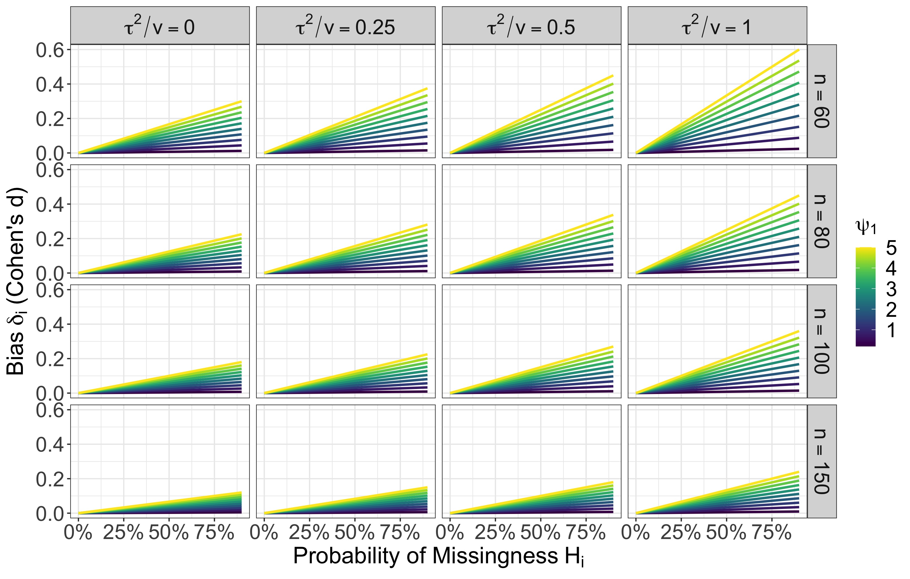

```{r setup, include=FALSE}
knitr::opts_chunk$set(echo = FALSE)
```

## Model

\[
T_i = \theta_i + e_i \\
\theta_i = X_i \beta + u_i  
\]

\[
\begin{align*}
\text{Effect parameter } \quad & \theta_i, i = 1, \ldots, k \\
\text{Effect estimate } \quad  & T_i \\
\text{Covariates } \quad      & X_i = [1, X_{i1}, ..., X_{ip}] \\
\text{Regression Coefficients } \quad & \beta \in \mathbb{R}^{p + 1} \\
\text{Random Effects } \quad & u_i \text{ with variance } \tau^2 \\
\text{Estimation Errors } \quad & e_i \text{ with variance } v_i \\
 & \\
\textbf{Complete-data Model } \quad & \underline{p(T_i | X_i, v_i)}
\end{align*}
\]


## Model (Matrix Form)

\[
\mathbf{T} = \mathbf{X} \beta + \mathbf{u} + \mathbf{e}
\]

Complete-data model of interest
\[
p(\mathbf{T} | \mathbf{X}, \mathbf{v})
\]

## Coefficient Estimates

\[
\hat{\beta} = (\mathbf{X}^T \mathbf{W} \mathbf{X})^{-1} \mathbf{X}^T \mathbf{W} \mathbf{T}
\]

where 
\[
\mathbf{W} = \text{diag}(1/(\tau^2 + v_i))
\]

- Unbiased if model is correctly specified


## Missing Covariates

Not all $X_{ij}$ are observed.

\[
R_i \in \mathcal{R} = \{0, 1\}^p
\]
where 
\[
R_{ij} = 
  \begin{cases}
    1 & \text{ if } X_{ij} \text{ observed } \\
    0 & \text{ if } X_{ij} \text{ missing } \\
  \end{cases}
\]

Note 
\[
R_i = [1, \ldots, 1] \implies \text{ all covariates observed }
\]


## Complete Case Analysis

Exclude rows $i$ in the data for which any covariate is missing.

\[
C = \{i: R_i = [1, \ldots, 1]\}
\]

Estimate using conventional formula:
\[
\hat{\beta}_{CC} = (\mathbf{X}_C^T \mathbf{W}_C \mathbf{X}_C)^{-1} \mathbf{X}_C^T \mathbf{W}_C \mathbf{T}_C
\]


## Complete Case $\neq$ Complete-Data Model

The complete-case analysis conditions on $R = [1, \ldots, 1] = \mathbf{1}$:

\[
p(T | X, v, R = \mathbf{1}) = \underbrace{\color{red}{p(T | X, v)}}_{\color{red}{complete-data}} \underbrace{\frac{p(R = \mathbf{1} | T, X, v)}{p(R = \mathbf{1} | X, v)}}_{selection}
\]
where 
\[
p(R = \mathbf{1} | X, v) = \int_{-\infty}^\infty p(R = \mathbf{1} | T, X, v) p(T | X, v) dT
\]


## A Note on Selection

- Let $\psi$ parameterize the selection model $p(R = \mathbf{1} | T, X, v)$
- Standard approaches to selection models for unobserved covariates use log-linear models, e.g., 

\[
\text{logit}[p(R = \mathbf{1} | T, X, v)] = 
  \psi_0 + \psi_1 T + \psi_2 X + \psi_3 v 
\]

- Not the only relevant model, but still useful.


## When Is Complete-Case Estimation Unbiased?

- Depends on the selection model.
- Unbiased estimation can happen if: 

     1. $p(R = \mathbf{1} | T, X, v) = \psi$ or $R \perp T, X, v \,$ (MCAR)
     2. $p(R = \mathbf{1} | T, X, v) = p(R = \mathbf{1} | v)$ or $R \perp (T, X) | v \,$ (MAR)
     3. $p(R = \mathbf{1} | T, X, v) = p(R = \mathbf{1} | X, v)$ or $R \perp T | X, v \,$ (MNAR)
     

## When Is Complete-Case Estimation Unbiased?

- Consider:
\[
\text{logit}[p(R = \mathbf{1} | T, X, v)] = 
  \psi_0 + \psi_1 T + \psi_2 X + \psi_3 v 
\]

1. $\psi_1 = \psi_2 = \psi_3 = 0$
2. $\psi_1 = \psi_2 = 0$
3. $\psi_1 = 0$


## Biased Estimation

Let 
\[
\text{logit}[p(R = \mathbf{1} | T, X, v)] = \sum_{j = 0}^n \psi_j f_j(T, X, v)
\]

Then 
\[
E[T | X, v, R = \mathbf{1}] \approx X\beta + \delta
\]
where 
\[
\delta = p(R \neq \mathbf{1} | T, X, v)\rvert_{T = X\beta} (\tau^2 + v) \sum_{j = 0}^m \left.\psi_j \frac{\partial f_j(T, X, v)}{\partial T}\right\rvert_{T = X\beta}
\]


## Biased Complete-Case Estimators

\[
E\left[(\mathbf{X}_C^T \mathbf{W}_C \mathbf{X}_C)^{-1} \mathbf{X}_C^T \mathbf{W}_C \mathbf{T}_C\right] - \beta 
 = (\mathbf{X}_C^T \mathbf{W}_C \mathbf{X}_C)^{-1} \mathbf{X}_C^T \mathbf{W}_C \Delta
\]

where $\Delta = [\delta_1, \ldots, \delta_k]^T$

- Bias will be a function of $\delta$ for each effect, which in turn is a function of the selection model.


## Example 

Suppose 
\[
\text{logit}[p(R = \mathbf{1} | T, X, v)] = 
  \psi_0 + \psi_1 T + \psi_2 X + \psi_3 v 
\]

Then 
\[
\delta \approx p[R \neq \mathbf{1} | X, v] (\tau^2 + v) \psi_1
\]


## Example: Interpret Parameter Values

Note that $\delta_i$ is increasing in:

- $p[R \neq \mathbf{1} | X, v]$ is essentially a missingness rate in [0, 1].
- $\tau^2 + v$ is the variation of $T$ around the regression line. 
     - For Cohen's $d$, $v \approx 4/n$ for sample size $n$.
     - Conventions of $\tau^2/v$ range from 0 to 1.


## Example: Interpreting Parameter Values

$\psi_1$ is a log-odds ratio.

- Conventions of odds ratios range from 1.5 to 5 (or 9 in some articles).
- $\psi_1$ depends on the scale of $T$. For Cohen's $d$ meaningful values might range from 0.1 to 0.3.
- $\psi_1$ might range from 0.04 to 0.5.
     

## Bias

{width=100%}


## How Does This Affect Estimators?

\[
\Delta_C = \mathbf{W}_C^{-1} \mathbf{P}_C \mathbf{f}(\psi)
\]

 
- $\mathbf{P}_C = \text{diag}[p(R \neq \mathbf{1} | X, v)]$
- $\mathbf{f}(\psi) = [\sum_{j = 0} \psi_j f_j'(X_i\beta, X_i, v_i)]^T$

     - For our example, $\mathbf{f}(\psi) = [\psi_1, \ldots, \psi_1]^T$
     
\[
\text{Bias}[\hat{\beta}_{CC}] \approx (\mathbf{X}^T \mathbf{W} \mathbf{X})^{-1} \mathbf{X}^T \mathbf{P}_C \mathbf{f}(\psi)
\]


## Example

- $X_i = [1, X_{i1}]$ where $X_{i1} \in \{0, 1\}$.
- $\beta = [\beta_0, \beta_1]$

\[
\text{Bias}[\hat{\beta}_{0CC}] = \frac{p(R \neq \mathbf{1} | X = 0, v)}{w_{0 \cdot}} \psi_1
\]

where $w_{0 \cdot} = \sum_{X_{i1} = 0} \frac{\sum_{X_{i1}} 1}{\tau^2 + v_i}$ is the mean weight among the studies with observed $X_{i1} = 0$.

