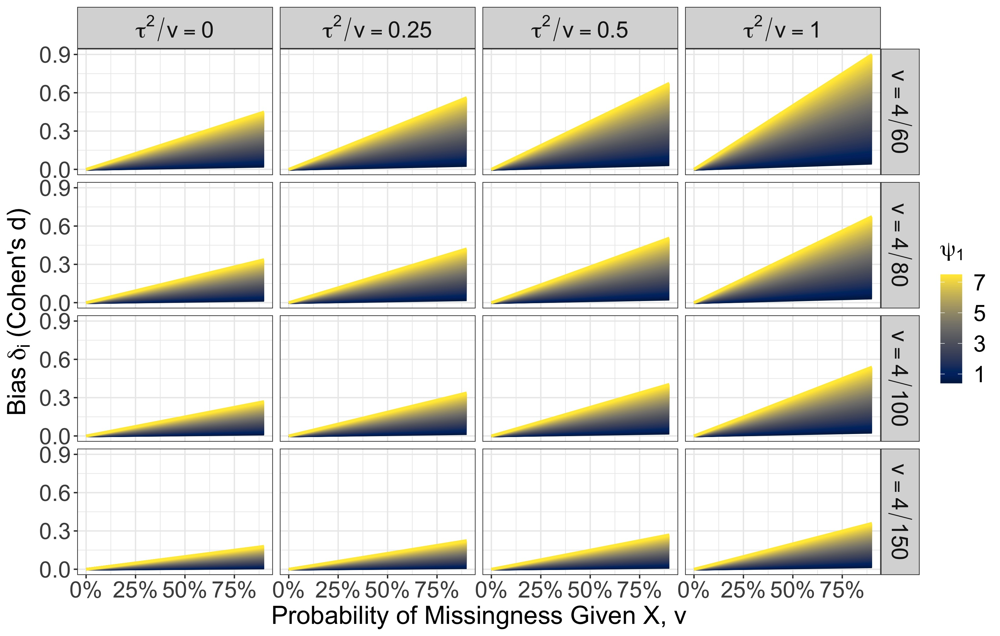

```{r setup, include=FALSE}
knitr::opts_chunk$set(echo = FALSE)
```

## Model

\[
\begin{align*}
T_i & = \theta_i + e_i \\
\theta_i 
  & = X_i \beta + u_i  \\
  & = \beta_0 + \beta_1 X_{i1} + \ldots + \beta_p + X_{ip} + u_i
\end{align*}
\]

\[
\begin{align*}
\text{Effect parameter } \quad & \theta_i, i = 1, \ldots, k \\
\text{Effect estimate } \quad  & T_i \\
\text{Covariates } \quad      & X_i = [1, X_{i1}, ..., X_{ip}] \\
\text{Regression Coefficients } \quad & \color{red}{\beta} \in \mathbb{R}^{p + 1} \\
\text{Random Effects } \quad & u_i \text{ with variance } \color{red}{\tau^2} \\
\text{Estimation Errors } \quad & e_i \text{ with variance } v_i \\
 & \\
\textbf{Complete-data Model } \quad & \underline{p(T_i | X_i, v_i)}
\end{align*}
\]


## Model (Matrix Form)

\[
\mathbf{T} = \mathbf{X} \color{red}{\beta} + \mathbf{u} + \mathbf{e} \\
\, \\
\mathbf{T} = \left[\begin{array}{c}T_1\\ \vdots  \\T_k \end{array}\right] \qquad
\mathbf{X} = \left[\begin{array}{c}X_1\\ \vdots  \\X_k \end{array}\right] \\
\, \\
V[\mathbf{u}] = \color{red}{\mathrm{T}} \qquad
V[\mathbf{e}] = \Sigma
\]

<br>

Complete-data model of interest
\[
p(\mathbf{T} | \mathbf{X}, \mathbf{v})
\]

## Coefficient Estimates

\[
\hat{\beta} = (\mathbf{X}^T \mathbf{W} \mathbf{X})^{-1} \mathbf{X}^T \mathbf{W} \mathbf{T}
\]

where $W$ is a matrix of weights
<br>

For independent effect sizes:
\[
\mathbf{W} = \text{diag}(1/(\tau^2 + v_i))
\]

<br>
<br>

Unbiased if model is correctly specified


## Missing Covariates

Not all $X_{ij}$ are observed.

Observed data indicators:
\[
R_i \in \mathcal{R} = \{0, 1\}^p
\]
where 
\[
R_{ij} = 
  \begin{cases}
    1 & \text{ if } X_{ij} \text{ observed } \\
    0 & \text{ if } X_{ij} \text{ missing } \\
  \end{cases}
\]

Note 
\[
R_i = [1, \ldots, 1] \implies \text{ all covariates observed }
\]


## How to handle missing covariates?

Proper answer depends on missingness mechanism:
\[
p(R | T, X, v)
\]

<br>
In practice, meta-analysts have either done:

- **Complete case analysis:** only include effects for which all relevant covariates are missing.
- **Shifting units of analysis:** only regress effects on 1-2 covariates at a time, and only including complete cases among those covariates.

     - *Shifting case analysis*


## Complete Case Analysis

Include rows $i$ in the data for which no covariate is missing:

\[
C = \{i: R_i = [1, \ldots, 1]\}
\]

Estimate using conventional formula:
\[
\hat{\beta}_{CC} = (\mathbf{X}_C^T \mathbf{W}_C \mathbf{X}_C)^{-1} \mathbf{X}_C^T \mathbf{W}_C \mathbf{T}_C
\]


## Shifting Case Analysis

Let 
\[
\begin{align*}
S & = \{j: X_{ij} \text{ in model }\} \\
U(S) & = \{i : R_{ij} = 1, \forall j \in S\} \\
\end{align*}
\]

- $\mathbf{X}_{US}$ would be the design matrix for a shifting-case analysis.
- $\mathbf{T}_U, \mathbf{W}_U$ are the relevant subsets of $\mathbf{T}, \mathbf{W}$.

SC Estimator:
\[
\hat{\beta}_{SC} = (\mathbf{X}_{US}^T \mathbf{W}_U \mathbf{X}_{US})^{-1} \mathbf{X}_{US}^T \mathbf{W}_U \mathbf{T}_U
\]


## Complete and Shifting Case Estimators

\[
\hat{\beta}_A = (\mathbf{X}_A^T \mathbf{W}_A \mathbf{X}_A)^{-1} \mathbf{X}_A^T \mathbf{W}_A \mathbf{T}_A
\]
<br>

Coefficient estimators will be unbiased if
\[
E[\mathbf{T}_A] = \mathbf{X}_A \beta
\]


## Conditional Inference

Both the complete and shifting case estimators condition on $R$.

- The complete case estimator conditions on $R = [1, \ldots, 1] = \mathbf{1}$.
- The shifting case estimator conditions on $R \in \mathcal{R}_j$.

     - Example: $X_i = [1, X_{i1}, X_{i2}]$. Regress $T_i$ on $X_{i1}$. Then this conditions on $R_i \in \mathcal{R}_1 = \{[1,0], [1,1]\}$

Both estimators **condition on missingness**


## Issues with Conditioning on Missingness

The complete-data model and the model conditional on missingness are not necessarily equivalent!

\[
p(T | X, v, R \in \mathcal{R}_j) = \underbrace{\color{red}{p(T | X, v)}}_{\color{red}{complete-data}} \underbrace{\frac{p(R \in \mathcal{R}_j | T, X, v)}{p(R \in \mathcal{R}_j | X, v)}}_{selection}
\]
where 
\[
p(R \in \mathcal{R}_j | X, v) = \int_{-\infty}^\infty p(R \in \mathcal{R}_j | T, X, v) p(T | X, v) dT
\]


## Potential Bias

\[
E[\mathbf{T} | \mathbf{X}, \mathbf{v}, R \in \mathcal{R}_j] \neq E[\mathbf{T} | \mathbf{X}, \mathbf{v}] = \mathbf{X}\beta
\]

We can write:
\[
\begin{align*}
E[\mathbf{T} | \mathbf{X}, \mathbf{v}, R \in \mathcal{R}_j] 
  & = \mathbf{X}\beta + \Delta_j \\
E[T_i | X_i, v_i, R_i \in \mathcal{R_j}] 
  & = X_i\beta + \delta_{ij}
\end{align*}
\]

where $\Delta_j = [\delta_{1j}, \ldots, \delta_{kj}]^T$

The bias terms $\delta_{ij}$ and hence $\Delta_j$ will depend on the selection model.


##

<br><br><br>
<font size="10">Complete case estimator bias</font>


## A Note on Selection

- Let $\psi$ parameterize the selection model $p(R = \mathbf{1} | T, X, v)$
- Standard approaches to selection models for unobserved covariates use log-linear models, e.g., for $X \in \mathbb{R}$:

\[
\text{logit}[p(R = \mathbf{1} | T, X, v)] = 
  \psi_0 + \psi_1 T + \psi_2 X + \psi_3 v 
\]

- Not the only relevant model, but still useful.


## When Is Complete-Case Estimation Unbiased?

- Depends on the selection model:
\[
p(T | X, v, R \in \mathbf{1}) = \underbrace{\color{red}{p(T | X, v)}}_{\color{red}{complete-data}} \underbrace{\frac{p(R \in \mathbf{1} | T, X, v)}{p(R \in \mathbf{1} | X, v)}}_{selection}
\]

- Unbiased estimation can happen if: 

     1. $p(R = \mathbf{1} | T, X, v) = \psi$ or $R \perp T, X, v \,$ (MCAR)
     2. $p(R = \mathbf{1} | T, X, v) = p(R = \mathbf{1} | v)$ or $R \perp (T, X) | v \,$ (MAR)
     3. $p(R = \mathbf{1} | T, X, v) = p(R = \mathbf{1} | X, v)$ or $R \perp T | X, v \,$ (MNAR)
     

## When Is Complete-Case Estimation Unbiased?

Example:
\[
\text{logit}[p(R = \mathbf{1} | T, X, v)] = 
  \psi_0 + \psi_1 T + \psi_2 X + \psi_3 v 
\]

Unbiased $\hat{\beta}_{CC}$ if:

1. $\psi_1 = \psi_2 = \psi_3 = 0$,
2. $\psi_1 = \psi_2 = 0$, **or**
3. $\psi_1 = 0$


## Biased Estimation

Consider the bias for a single effect:

\[
E[T_i | X_i, v_i, R_i = \mathbf{1}] = X_i\beta + \delta_i
\]

\[
E\left[(\mathbf{X}_C^T \mathbf{W}_C \mathbf{X}_C)^{-1} \mathbf{X}_C^T \mathbf{W}_C \mathbf{T}_C\right] - \beta 
 = (\mathbf{X}_C^T \mathbf{W}_C \mathbf{X}_C)^{-1} \mathbf{X}_C^T \mathbf{W}_C \Delta
\]

where $\Delta = [\delta_1, \ldots, \delta_k]^T$

<br>
Bias will be a function of $\delta$ for each effect, which in turn is a function of the selection model.


## What does bias look like?

Suppose missingness follows a log-linear model:
\[
\text{logit}[p(R_i = \mathbf{1} | T_i, X_i, v_i)] = \sum_{j = 0}^n \psi_j f_j(T_i, X_i, v_i)
\]

Then it can be shown that:
\[
\delta_i \approx (\tau^2 + v_i) \left[p(R_i \neq \mathbf{1} | T_i, X_i, v_i) \sum_{j = 0}^m \left.\psi_j \frac{\partial f_j(T_i, X_i, v_i)}{\partial T_i}\right]\right\rvert_{T_i = X_i\beta}
\]


## Example 

Compelte-data model:
\[
T_i = \beta_0 + \beta_1 X_i + u_i + e_i
\]

Selection model:
\[
\text{logit}[p(R_i = \mathbf{1} | T_i, X_i, v_i)] = 
  \psi_0 + \psi_1 T_i + \psi_2 X_i + \psi_3 v_i 
\]

Then 
\[
\delta_i \approx p[R_i \neq \mathbf{1} | X_i, v_i] (\tau^2 + v_i) \psi_1
\]


## Example: Interpreting $\delta$

Note that $\delta_i$ is increasing in:

- $p[R \neq \mathbf{1} | X, v]$ is essentially a missingness rate in [0, 1).
- $\tau^2 + v$ is the variation of $T$ around the regression line. 
     - For Cohen's $d$, $v \approx 4/n$ for sample size $n$.
     - Conventions of $\tau^2/v$ range from 0 to 1.
     - $\tau^2 + v$ might be $4(1 + c)/n$ for $c = [0, 1]$


## Example: Interpreting $\psi$

$\psi_1$ is a log-odds ratio.

- Conventions of odds ratios range from 1.5 to 5 (or 9 in some articles).
  
     - Logs of these values range from 0.4 to 1.6
     
- $\psi_1$ depends on the scale of $T$. 

     - For Cohen's $d$ meaningful values might range from 0.1 to 1.
     
- $\psi_1$ might range from 0.4 to over 16.
     

## Bias

{width=100%}


## Example

- $X_i = [1, X_{i1}]$ where $X_{i1} \in \{0, 1\}$
- $T_i = \beta_0 + \beta_1 X_{i1} + u_i + e_i$
- $\beta = [\beta_0, \beta_1]$

\[
\text{Bias}[\hat{\beta}_{0CC}] \approx V_0 p(R \neq \mathbf{1} | X = 0, v) \psi_1
\]

where 
\[
V_0 = \sum_{X_{i1} = 0} \frac{\tau^2 + v_i}{\sum_{X_{i1}} 1}
\]
is the mean variance among the studies with observed $X_{i1} = 0$.

- Bias of $\hat{\beta}_{0CC}$ is the average $\delta_i$ for $X_{i1} = 0$.


## Example

\[
\text{Bias}[\hat{\beta}_{1CC}] \approx [p(R = 0 | X = 1)V_1 - p(R = 0 | X = 0)V_0] \psi_1
\]

If $v_i \approx v$ then bias is
\[
(\tau^2 + v)[p(R = 0 | X = 1) - p(R = 0 | X = 0)]\psi_1
\]

- $p(R = 0 | X = 1) - p(R = 0 | X = 0)$ can be thought of as *differential missingness*.

     - It is a function of $\psi$
     - Is is approximately similar to a Pearson correlation.
     

## Bias

{width=100%}


## Questions \& Notes

Notes:

- Shifting case analyses have two sources of bias: one from omitting variables, one from omitting observations. 

     - SCA can be much more biased unless those biases offset.

- Bias for either model can increase in complexity if the selection model is more complex.

Questions: 

- What is a reasonable value of $\psi_1$? 
- Does the matrix expression for approximate bias serve a purpose?
- What alternative to log-linear models can describe selection?

